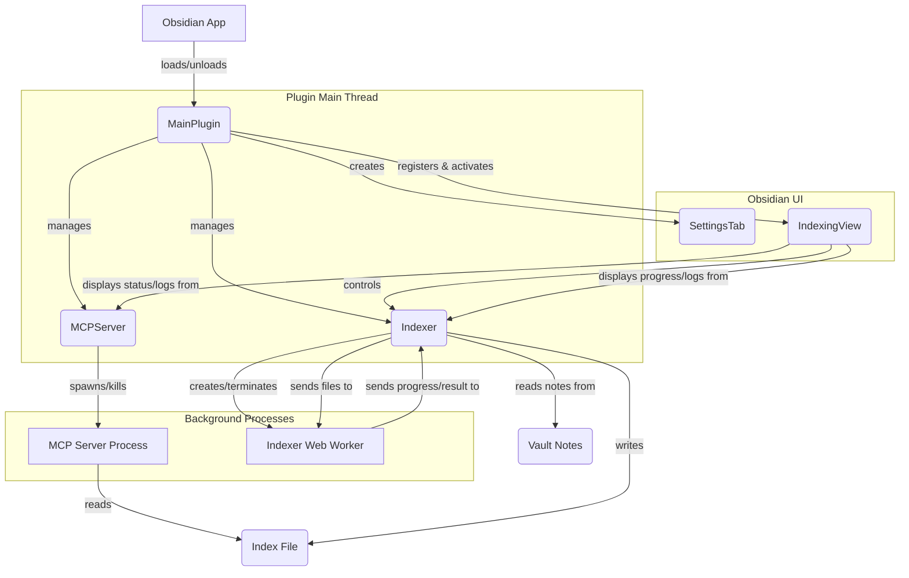

# Архитектура плагина Obsidian для интеграции с MCP (v2)

## 1. Обзор

Этот документ описывает архитектуру плагина Obsidian, который индексирует заметки пользователя и предоставляет их для векторного поиска через Model Context Protocol (MCP). Вторая версия архитектуры учитывает необходимость выполнения длительных задач в фоновом режиме и предоставляет более детальный пользовательский интерфейс.

## 2. Компоненты

### 2.1. `MainPlugin` (main.ts)

Основной класс плагина, наследуемый от `obsidian.Plugin`.

*   **Жизненный цикл:** Управляет инициализацией (`onload`) и выгрузкой (`onunload`) плагина.
*   **Управление MCP-сервером:** Создает и управляет экземпляром `MCPServer`.
*   **Регистрация команд:** Регистрирует команду "Индексировать хранилище" и другие.
*   **Управление настройками:** Загружает, сохраняет и предоставляет доступ к настройкам плагина.
*   **Регистрация View:** Регистрирует `IndexingView`.

### 2.2. `MCPServer` (mcp_server.ts)

Управляет дочерним процессом MCP-сервера.

*   **Запуск/остановка:** Использует `child_process.spawn` из Node.js для запуска и остановки Python-сервера. Путь к исполняемому файлу Python и скрипту сервера будет настраиваемым.
*   **Управление состоянием:** Отслеживает состояние сервера (запущен, остановлен, ошибка) и предоставляет методы для его проверки.
*   **Перезапуск:** Реализует логику автоматического перезапуска сервера в случае сбоя.
*   **Логирование:** Перехватывает `stdout` и `stderr` дочернего процесса и направляет их в `IndexingView` для отображения пользователю.

### 2.3. `Indexer` (indexer.ts)

Отвечает за процесс индексации. Будет выполняться в **Web Worker** для предотвращения блокировки основного потока.

*   **Worker Thread (indexer.worker.ts):**
    *   **Получение заметок:** Получает список файлов для индексации от основного потока.
    *   **Генерация векторов:** Использует библиотеку `sentence-transformers/dist/sentence-transformers.js` (или аналогичную, адаптированную для веба) для преобразования текста заметок в векторы.
    *   **Отправка прогресса:** Отправляет сообщения о прогрессе (например, ` { type: 'progress', processed: 50, total: 100 }`) в основной поток.
    *   **Возврат результата:** По завершении отправляет результат (индекс) в основной поток.
*   **Indexer (indexer.ts):**
    *   **Управление Worker'ом:** Создает, запускает и обрабатывает сообщения от Web Worker'а.
    *   **Подготовка данных:** Собирает все `.md` файлы с помощью `app.vault.getMarkdownFiles()` и `app.vault.cachedRead()` и передает их в Worker.
    *   **Сохранение индекса:** Получает готовый индекс от Worker'а и сохраняет его в файл `index.json` в папке плагина (`this.app.vault.configDir + '/plugins/obsidian-mcp-plugin/index.json'`).

### 2.4. `IndexingView` (indexing_view.ts)

Кастомное View (`obsidian.ItemView`) для взаимодействия с пользователем.

*   **Отображение статуса:** Показывает статус MCP-сервера и процесса индексации.
*   **Кнопки управления:** Предоставляет кнопки для запуска/остановки индексации и перезапуска MCP-сервера.
*   **Логи:** Отображает логи от MCP-сервера и Worker'а.
*   **Прогресс-бар:** Показывает прогресс индексации.

### 2.5. `SettingsTab` (settings.ts)

Пользовательский интерфейс для настроек.

*   **Порт MCP-сервера:** Поле для ввода порта.
*   **Путь к Python:** Поле для указания пути к интерпретатору Python.
*   **Выбор модели:** Выпадающий список для выбора модели векторизации.
*   **Исключенные папки:** Интерфейс для добавления папок, которые не нужно индексировать.

## 3. Взаимодействие компонентов



## 4. Структура данных

### 4.1. `settings.json`

```json
{
  "mcp_port": 8080,
  "python_path": "/usr/bin/python3",
  "embedding_model": "all-MiniLM-L6-v2",
  "excluded_folders": [
    "private/",
    "templates/"
  ]
}
```

### 4.2. `index.json`

Файл с векторными представлениями заметок.

```json
[
  {
    "path": "path/to/note1.md",
    "content_preview": "Начало содержимого заметки 1...",
    "vector": [0.1, 0.2, ..., 0.9]
  },
  {
    "path": "path/to/note2.md",
    "content_preview": "Начало содержимого заметки 2...",
    "vector": [0.4, 0.5, ..., 0.3]
  }
]
```
*   `content_preview` будет использоваться для отображения в результатах поиска, чтобы дать пользователю контекст.

## 5. API для MCP

MCP-сервер будет предоставлять один основной эндпоинт для поиска.

*   `POST /search`
    *   **Назначение:** Выполняет векторный поиск по проиндексированным заметкам.
    *   **Request Body:**
        ```json
        {
          "query_text": "Текст запроса для поиска",
          "top_k": 5
        }
        ```
        *   Сервер сам преобразует `query_text` в вектор, используя ту же модель, что и при индексации.
    *   **Response Body:**
        ```json
        {
          "results": [
            {
              "path": "path/to/note1.md",
              "score": 0.95,
              "content_preview": "Начало содержимого заметки 1..."
            },
            {
              "path": "path/to/note2.md",
              "score": 0.87,
              "content_preview": "Начало содержимого заметки 2..."
            }
          ]
        }
        ```

## 6. План реализации (уточненный)

1.  **Настройка окружения:**
    *   Создать базовый проект плагина.
    *   Настроить esbuild для сборки Web Worker'а.
2.  **Реализация `MCPServer`:**
    *   Написать код для запуска/остановки дочернего процесса.
    *   Реализовать логику перезапуска и логирования.
3.  **Реализация `Indexer` и Web Worker'а:**
    *   Создать `indexer.worker.ts`.
    *   Интегрировать библиотеку для векторизации.
    *   Настроить обмен сообщениями между основным потоком и Worker'ом.
4.  **Реализация `IndexingView`:**
    *   Создать кастомное View.
    *   Реализовать отображение статуса, логов и прогресс-бара.
5.  **Реализация `MainPlugin`:**
    *   Связать все компоненты.
    *   Зарегистрировать View и команды.
6.  **Реализация `SettingsTab`:**
    *   Создать расширенный интерфейс настроек.
7.  **Создание MCP-сервера:**
    *   Написать сервер на Python (FastAPI), который будет использовать `index.json`.